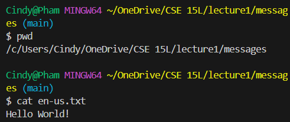

**{Using the code from Lab 1}**

## For The `cd` Command:

**1)Share an example of using the command with no arguments:**

The absolute path before entering command?: `/c/Users/Cindy/OneDrive/CSE 15L` 

Why did I get this output?: When using `cd`, or the change directory command, without any arguments, it will be automated to move to the variable considered as **Home** if it does exist in the system. In this case: `/c/Users/Cindy` is its home directory.

Was it an error?: This is not an error since it worked in the system and moved the current directory as intended.
  
**2)Share an example of using the command with a path to a directory as an argument:**

The absolute path before entering the command?: `/c/Users/Cindy`

Why did I get this output?: When using the `cd` command with `lecture1` for the directory argument, it changes the current directory to `lecture1`. Thus making the current path: `/c/Users/Cindy/lecture1`

Was it an error?: No, it was not an error because it worked as intended as the directory changed into the directory given in the argument which was `lecture1`.

**3)Share an example of using the command with a path to a file as an argument:**

**UPDATE:**

**UPDATE:**

The absolute path before entering the command?: `/c/Users/Cindy/lecture1`

Why did I get this output?: When using the `cd` command with `messages` for the file argument, it entered the file labeled `messages` since it existed in the directory of `lecture1`. Thus making this current path:`/c/Users/Cindy/lecture1/messages`.

Was it an error?: No, it was not an error because it worked as intended as the command was asked to enter the file `messages` if it existed in the directory `lecture1` which it is.

**UPDATE:**
Was it an error?: Yes, it was an error because `Hello.java` is not considered a directory by the `cd` command.
**UPDATE:**

## For The `ls` Command:

**1)Share an example of using the command with no arguments:**

The absolute path before entering the command?: `/c/Users/Cindy/OneDrive/CSE 15L`

Why did I get this output?: Since I'm in a folder called `CSE 15L` when using the `ls` command -
the list command-, will list out the contents of the current directory in the terminal which are: `lecture1` and `wavelet`.

Was it an error?: No, it was not an error because it worked as intended as it printed the content of the current directory in the terminal.  

**2)Share an example of using the command with a path to a directory as an argument:**

The absolute path before entering the command?:  `/c/Users/Cindy/OneDrive/CSE 15L`

Why did I get this output?: When using the `ls` command with `lecture1` for the directory argument, it looked into the `lecture1` directory to print its content on the terminal. The current directory is still `/c/Users/Cindy/OneDrive/CSE 15L`.

Was it an error?: No, it was not an error because it worked as intended since the `lecture1` directory was in the current directory, `ls` was able to look into its content but can't access it as it's not in the same pathing currently. 

**3)Share an example of using the command with a path to a file as an argument:**

**UPDATE:**

**UPDATE:**

The absolute path before entering the command?: `/c/Users/Cindy/OneDrive/CSE 15L/lecture1`

Why did I get this output?: When using the `ls` command with `messages` for the file argument, it would give me: `en-us.txt`, `es-mx.txt`, and `zh-cn.txt` in return since I'm currently in the `lecture1` directory.

Was it an error?:  No, it was not an error because it worked as intended since the `lecture1` directory was in the current directory, it was able to `ls` the file messages for its files since a file of `lecture1` itself. 

**UPDATE:**
Was it an error?: No because the terminal allowed it to go through and when using the `ls` command on `Hello.java`, it returns `Hello.java` back in the terminal
**UPDATE:**

## For The `cat` Command:

**1)Share an example of using the command with no arguments:**

The absolute path before entering the command?: `/c/Users/Cindy/OneDrive/CSE 15L`

Why did I get this output?: When using the `cat` command with no arguments, it would just copy whatever input I typed in to print it as an output. This is shown in the image above.

Was it an error?:  No, it was not an error because it worked as intended but since it doesn't have any paths or files to combine, it would default to standard input unless `Ctrl + C` is used to stop it.

**2)Share an example of using the command with a path to a directory as an argument:**

The absolute path before entering the command?: `/c/Users/Cindy/OneDrive/CSE 15L`

Why did I get this output?: When the `cat` command with `lecture1` for the directory argument, it returns saying that `lecture1` is a directory. It is confirming that there's another pathway that you can go deeper with. 

Was it an error?:  No, it was not an error because it worked as intended but since it doesn't have other paths/files to combine with `lecture1`, it defaults to printing since the `cat` command is used for creating, merging, viewing, etc. 

**UPDATE:**
Was it an error?: Yes because `messages` is a directory and not a file. 
**UPDATE:**

**3)Share an example of using the command with a path to a file as an argument:**

The absolute path before entering the command?: `/c/Users/Cindy/OneDrive/CSE 15L/lecture1/messages`

Why did I get this output?: When the `cat` command with `en-us.txt` for the file argument, after `cd` to `messages`, it prints out the content of `en-us.txt` which is: `Hello World!`

Was it an error?: No, it was not an error because it worked as intended as some of its features is to view and print the content of a file, which is `en-us.txt` in this case. 
