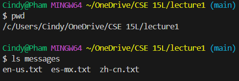

**{Using the code from Lab 1}**

## For The `cd` Command:

**1)Share an example of using the command with no arguments:**

The absolute path before entering command?: `/c/Users/Cindy/OneDrive/CSE 15L` 

Why did I get this output?: When using `cd`, or the change directory command, without any arguments, it will be automated to move to the variable considered as **Home** if it does exist in the system. In this case: `/c/Users/Cindy` is its home directory.

Was it an error?: This is not an error since it worked in the system and moved the current directory as intended.
  
**2)Share an example of using the command with a path to a directory as an argument:**

The absolute path before entering command?:

Why did I get this output?:

Was it an error?:

**3)Share an example of using the command with a path to a file as an argument:**

The absolute path before entering command?:

Why did I get this output?:

Was it an error?:

## For The `ls` Command:

**1)Share an example of using the command with no arguments:**

The absolute path before entering command?:

Why did I get this output?:

Was it an error?:

**2)Share an example of using the command with a path to a directory as an argument:**

The absolute path before entering command?:

Why did I get this output?:

Was it an error?:

**3)Share an example of using the command with a path to a file as an argument:**

The absolute path before entering command?:

Why did I get this output?:

Was it an error?:

## For The `cat` Command:

**1)Share an example of using the command with no arguments:**

The absolute path before entering command?:

Why did I get this output?:

Was it an error?:

**2)Share an example of using the command with a path to a directory as an argument:**

The absolute path before entering command?:

Why did I get this output?:

Was it an error?:

**3)Share an example of using the command with a path to a file as an argument:**

The absolute path before entering command?:

Why did I get this output?:

Was it an error?:
