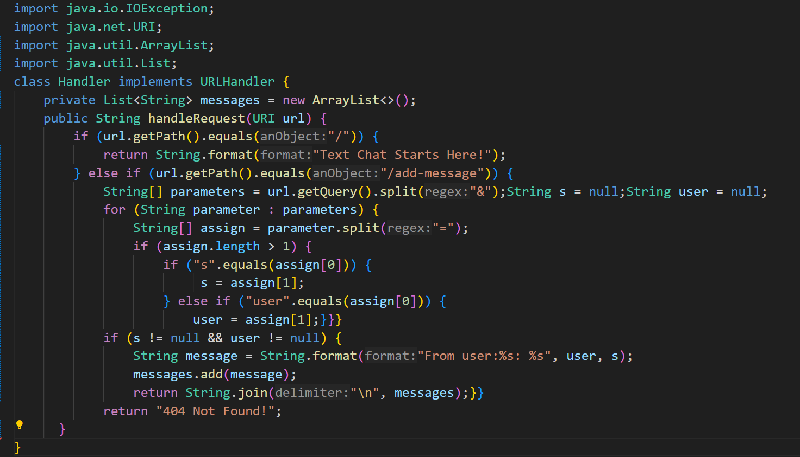
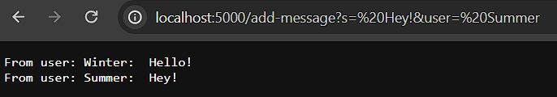
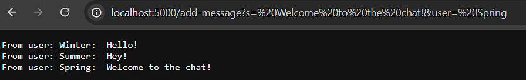
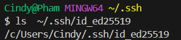
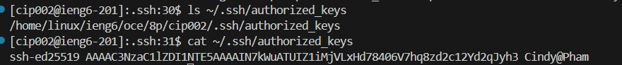
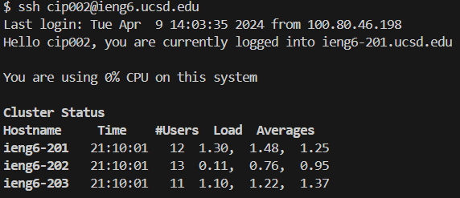

## Part 1

**CODE:**

**It's condensed a bit so I could screenshot it.**

**Screenshots:**

1) My code called 7 methods: `URI.getPath()`, `String.equals()`, `String.format()`, `URI.getQuery()`, `String.split()`, `List.add()`, and `String.join()`.
2) Used a lot of string, or string-like, arguments like: `String=user`, `String=s`, `String[]=parameters`, and `String[]=assign`.
3) I did use the `Wavelet` folder with the `Server.java` and `NumberServer.java` as a base for the Chat/Text Server. So the code's values changed from `int` to `String` to fit what I needed.

1) My code called 7 methods: `URI.getPath()`, `String.equals()`, `String.format()`, `URI.getQuery()`, `String.split()`, `List.add()`, and `String.join()`.
2) Used a lot of string, or string-like, arguments like: `String=user`, `String=s`, `String[]=parameters`, and `String[]=assign`.
3) I did use the `Wavelet` folder with the `Server.java` and `NumberServer.java` as a base for the Chat/Text Server. So the code's values changed from `int` to `String` to fit what I needed.

## Part 2

1)On your computer's command line, run ls with the absolute path to the private key for your SSH key for logging into ieng6.

2)On the command line of the ieng6 machine, run ls with the absolute path to the public key for your SSH key for logging into ieng6.

3)A terminal interaction where you log into your ieng6 account without being asked for a password.

## Part 3

I learned a lot about how web browsers work or at least the very basics of it. It was my first time using the ieng6 machine and its function during the lab. Overall, I liked that lab because I could understand and follow along during it. 
