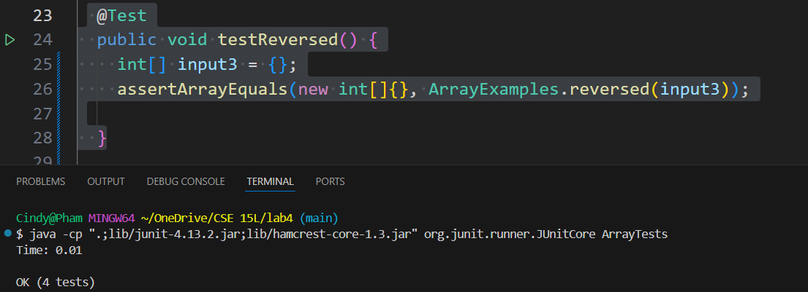

## Part 1 - Bugs (Using Code From Lab4)

1)

**Base Code:**
```
static int[] reversed(int[] arr) {
    int[] newArray = new int[arr.length];
    for(int i = 0; i < arr.length; i++) {
      newArray[i] = newArray[arr.length - i - 1];
    }
    return newArray;
}
```

**Failure-Inducing Test:**
```
@Test
public void testReversed2() {
    int[] input4 = {1,2,3,4};
    assertArrayEquals(new int[]{4,3,2,1}, ArrayExamples.reversed(input4));
}
```

2)

**Base Code:**
```
static int[] reversed(int[] arr) {
    int[] newArray = new int[arr.length];
    for(int i = 0; i < arr.length; i++) {
      newArray[i] = newArray[arr.length - i - 1];
    }
    return newArray;
}
```

**Non-Failing Test:**
```
 @Test
  public void testReversed() {
    int[] input3 = {};
    assertArrayEquals(new int[]{}, ArrayExamples.reversed(input3));
 }
```

3)

**Passing:**



**Failing:**


4)

**Base Code:**
```
static int[] reversed(int[] arr) {
    int[] newArray = new int[arr.length];
    for(int i = 0; i < arr.length; i++) {
      newArray[i] = newArray[arr.length - i - 1];
    }
    return newArray;
}
```

**Modified Code:**
```diff
static int[] reversed(int[] arr) {
    int[] newArray = new int[arr.length];
    for(int i = 0; i < arr.length; i++) {
-      newArray[i] = newArray[arr.length - i - 1];
+      newArray[i] = arr[arr.length - i - 1];
    }
    return newArray;
}
```

5)

It was a simple fix of changing `newArray` to `arr` to correct the issue. With `newArray`, it was assigning the values to itself when it was supposed to assign them to `arr`.

## Part 2 - Researching Commands (Using The Code of `docsearch`)

**Researched command: Grep**

### -w (--word-regexp -matches only whole words)
1)

```
Cindy@Pham MINGW64 ~/OneDrive/CSE 15L/docsearch/technical (main)
$ grep -w "newspaper" ./911report/chapter-2.txt
                newspaper in London to publish what they termed a fatwa issued in the name of a
                newspaper in London that had first published Bin Ladin's February fatwa, and it
```

What's it doing and why it's useful:  It is finding all the times the word `"newspaper"` shows up. It is useful because it removes the unrelated lines that don't have keywords.

2)

```
Cindy@Pham MINGW64 ~/OneDrive/CSE 15L/docsearch/technical (main)
$ grep -w "We" ./911report/chapter-3.txt
            We mention many personalities in this report. As in any study of the U.S. government,
                some of the most important characters are institutions. We will introduce various
            We will describe some of the unfortunate consequences of these accumulated
                regime in Afghanistan to deport Bin Ladin. Armitage replied: "We do what the State
                skills. We must act together, or unilaterally, if necessary to ensure that
                committee eventually titled the Counterterrorism Security Group (CSG). We will later
                performed well. DCI Tenet told us: "We ran from threat to threat to threat. . . .
                level of attention in the Congress to the terrorist threat was low. We examined the
                their advice solely on national security considerations. We have found no reason to
                tribals-to "do what we won't do." Schroen was disappointed too." We should have done
                it last night," he wrote." We may well come to regret the decision not to go
                that their response was,"We will try our best to capture Bin Ladin alive and will
                confirmed this understanding." We always talked about how much easier it would have
                Zinni said, "It was easy to take the shot from Washington and walk away from it. We
                operations might fail disastrously. We have found no evidence that such a long-term
                possibility that Bin Ladin could not be brought out alive." We were plowing the same
                responsibly." George would call and say,'We just don't have it,'" Berger said.
```

What's it doing and why it's useful: It is finding all the times the word `"We"` shows up. It is useful because it removes the unrelated lines that don't have keywords.

### -v (--invert-match -select non-matching lines)
3)

```
Cindy@Pham MINGW64 ~/OneDrive/CSE 15L/docsearch/technical (main)
$ grep -v "The" ./911report/chapter-1.txt

"WE HAVE SOME PLANES"

    Tuesday, September 11, 2001, dawned temperate and nearly cloudless in the eastern United States. Millions of men and women readied themselves for work. Some made their way to the Twin Towers, the signature structures of the World Trade Center complex in New York City. Others went to Arlington, Virginia, to the Pentagon. Across the Potomac River, the United States Congress was back in session. At the other end of Pennsylvania Avenue, people began to line up for a White House tour. In Sarasota, Florida, President George W. Bush went for an early morning run.
```

What's it doing and why it's useful: It filters out any line that has `"The"` in its line. It is useful because if you looking over a file with information and don't want certain information `grep -v` helps with that.

4)

```
Cindy@Pham MINGW64 ~/OneDrive/CSE 15L/docsearch/technical (main)
$ grep -v "Legal" ./government/Media/5_Legal_Groups.txt
Vulnerable
Salt Lake City Tribune

BY EDWARD MCDONOUGH
Five independent Salt Lake organizations that provide legal
services to the poor, ethnic minorities, seniors and people with
disabilities have joined together to acquire a west-side downtown
building where they will have their offices. The new Community
All," which, until this venture, has been a joint fund-raising
campaign by an alliance of the non-profit providers of free legal
services. "And Justice for All," which solicits donations primarily
from Utah lawyers and foundations, was the first joint fund-raising
campaign of legal services agencies in the country, and the
service law groups.
```

What's it doing and why it's useful: It filters out any line that has `"Legal"` in its line. It is useful because if you looking over a file with information and don't want certain information `grep -v` helps with that.

### -h (--no-filename -suppress the file name prefix on output)
5)

```
Cindy@Pham MINGW64 ~/OneDrive/CSE 15L/docsearch/technical (main)
$ grep -h "Legal" ./government/Media/Annual_Fee.txt
Annual Fee to Rise $49; Legal Aid Gets Boost
agencies throughout the state, including the Legal Assistance
Foundation of Metropolitan Chicago, Land of Lincoln Legal
Legal Services, based in Rockford.

```

What's it doing and why it's useful: When used in many files, it removes the filenames for the output of the command. It also helps to find the lines in which the keyword(s) appears, in this case, "Legal".

6)

```
Cindy@Pham MINGW64 ~/OneDrive/CSE 15L/docsearch/technical (main)
$ grep -h "Barnes" ./government/Media/Barnes_Volunteers.txt Barnes_new_job.txt
Barnes Volunteers as Lawyer to Poor
Defeated last month for re-election, Gov. Roy Barnes announced
Mr. Barnes said he already has his first case, but he wouldn't
Mr. Barnes said he was hoping to send a message to other
Mr. Barnes did not necessarily need to seek a top-salaried job
he released in June showed Mr. Barnes had a net worth of $12.3
(unpaid) lawyer at the Atlanta Legal Aid Society.
support for their kids. of Legal
funded Atlanta Legal Aid Society. Most memorably, he secured a $115
Mauricio Vivero is vice president of Legal Services Corporation,

```

What's it doing and why it's useful:  When used in many files, it removes the filenames for the output of the command. It also helps to find the lines in which the keyword(s) appears, in this case, "Barnes". 


### -o  (--only-matching -shows only the part of a line matches)
7)

```
Cindy@Pham MINGW64 ~/OneDrive/CSE 15L/docsearch/technical (main)
$ grep -o "JSTOR" ./plos/journal.pbio.0020010.txt
JSTOR
JSTOR
JSTOR
JSTOR
JSTOR
JSTOR
JSTOR
JSTOR
JSTOR
JSTOR
JSTOR
JSTOR
JSTOR
JSTOR
JSTOR
JSTOR
JSTOR
JSTOR
JSTOR
JSTOR
JSTOR
JSTOR
JSTOR

```

What's it doing and why it's useful: It returns each time the keywords are found in the file in this case, "JSTOR". It is useful when trying to find how many times that keyword(s) appears.

8)

```
Cindy@Pham MINGW64 ~/OneDrive/CSE 15L/docsearch/technical (main)
$ grep -o "genome" ./plos/journal.pbio.0020042.txt
genome
genome
genome
genome
genome
genome
genome
genome
genome
genome
genome
genome
genome
genome
genome
genome
genome
genome
genome
genome
genome
```

What's it doing and why it's useful: It returns each time the keywords are found in the file in this case, "genome". It is useful when trying to find how many times that keyword(s) appears.


Citing Source(s): https://www.geeksforgeeks.org/grep-command-in-unixlinux/ , GitHub Copilot(Explain and Why it's useful) to each command. 
