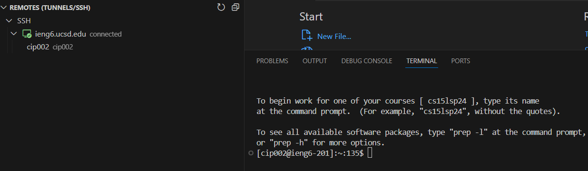
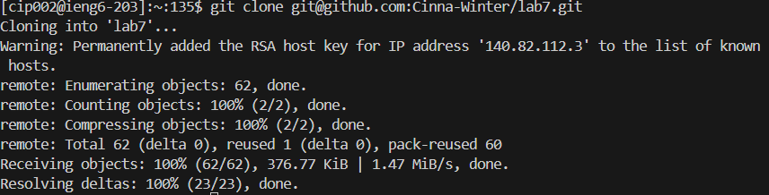
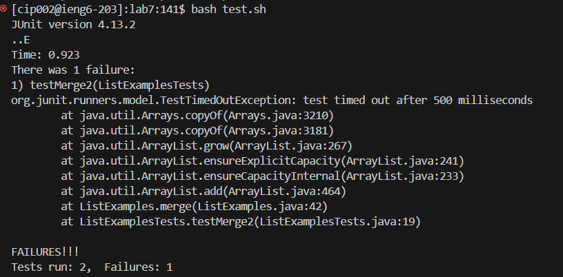
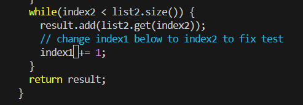
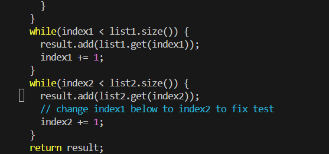
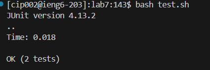
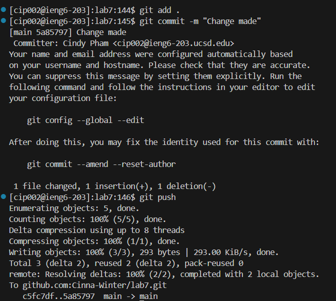
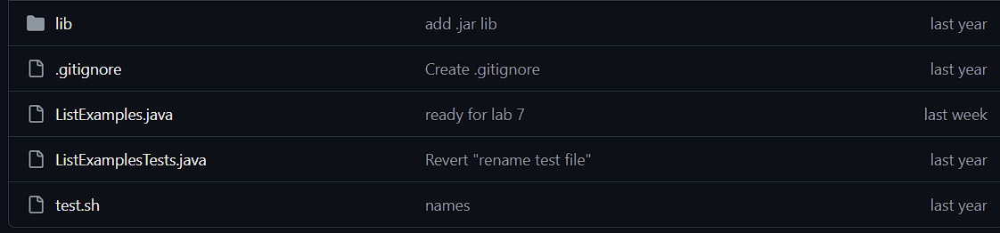
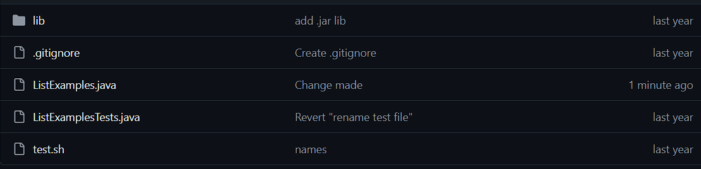

# Lab Report 4

## Step 4 (Log into Ieng6)

**Screenshot:**



**Keypresses/Clicks:**

```
<Click on Remote Explorer>, <Click connect in New Window>, <Press Ctrl+Shift+`>.
```

**Summary:**

Having VScode already opened, I clicked on the icon for Remote Explorer, opened a new window to log into Ieng6, and pressed `Ctrl+Shift+(backtick)` to open a new terminal.

## Step 5 (Clone your fork of the repository from your GitHub account (using the SSH URL))

**Screenshot:**



**Keypresses/Clicks:**

```
<Click on the SSH URL on GitHub>, <Paste in the SSH Link>, <Enter>.

```

**Summary:**

After copying the SSH URL from GitHub, go into the Ieng6 engine, type in `git clone`, paste in `git@github.com:Cinna-Winter/lab7.git`, then press `<enter>`.

## Step 6 (Run the tests, demonstrating that they fail.)

**Screenshot:**



**Keypresses:**

```
<cd Lab7> <up arrow x30~> <bash test.sh> <enter>.
```

**Summary:**

After `cd` into `lab7`, I used the `<up arrow>` key to scroll to the past command of `bash test.sh`, pressed `<enter>` to bash the `test.sh` to get tests run and its failure.  

## Step 7 (Edit the code file to fix the failing test.)

**Screenshot:**

Before:



After:



**Keypresses:**

```
<up arrow x30~>, <vim ListExamples.java>, <enter>, <:44> <I>, <up arrow x6>, <backspace>, <press 2>, <escape>, <:wq!>, <enter>.
```

**Summary:**

I used the `<up arrow>` key to find the past command of `<vim ListExamples.java>`. Once in the Vim, I searched for the exact line of code with `:44`, entered insert mode, and changed the code of Index1 to Index2 to make the code work. I used `:wq!` to save and quit Vim.

## Step 8 (Run the tests, demonstrating that they now succeed.)

**Screenshot:**



**Keypresses:**

```
<up arrow x2> <bash test.sh>, <enter>.
```

**Summary:**

I used the `<up arrow>` key to find the past command of `<bash test.sh>`. I reran the program to get all the tests cleared.

## Step 9 (Commit and push the resulting change to your GitHub account (you can pick any commit message!)

**Screenshot:**



Before:



After:



**Keypresses:**

```
<up arrow x30~>, <git add .>, <enter>, <up arrow x30~>, <git commit -m "Change made">, <enter>,<up arrow x30~>, <git push>, <enter>.
```

**Summary:**

I used the `<up arrow>` key to find the past command of `<git add .>`, `<git commit -m "Change made">`, `<git push>`. Using these, I could insert my change in the forked repository.


