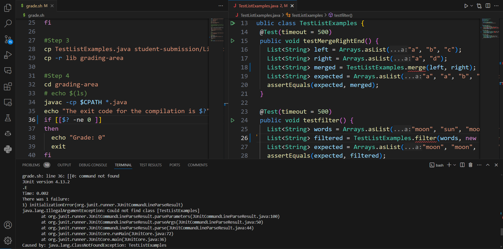
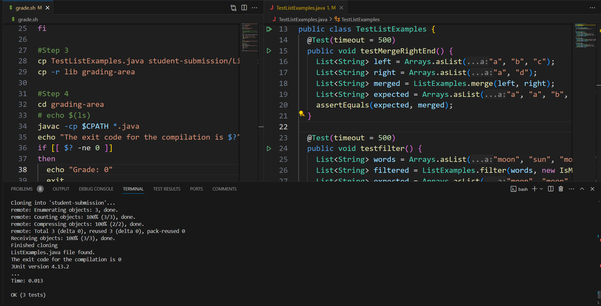
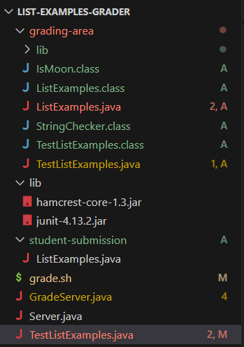
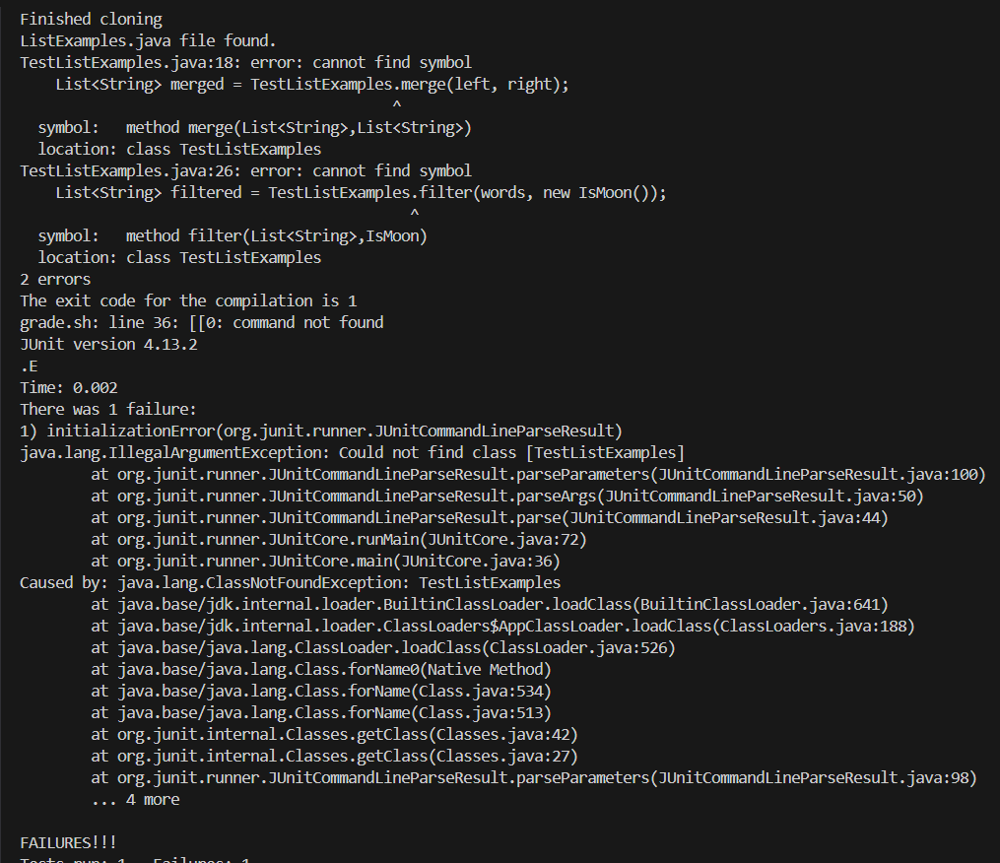

# Part 1 (Debugging Scenario)

## 1) Student Submission:

**Cinna:**

>Hey! I'm having a bit of trouble getting my code to work. I've been trying to check whether or not the "grade.sh" was missing something but everything seems right. Also, my "TestListExamples.java" has red lines and the terminal is saying that it "Could find the class [TestListExamples]" even though it's in the class itself? Is it a syntax error or mistyping? Could I be pointed in the right direction?



## 2) TA Aid:

**Winter:**

> Hello! From what I tell from the screenshot, there are some bugs. There is at least one in both your grade.sh and TestListExamples.java. For the TestListExamples.java, when the terminal says "Could find the class [TestListExamples]", it suggests that something in the code isn't called correctly. Make sure that the method(s) are calling the .java that it is meant for. Since the class it's trying to call is meant for another .java. For grade.sh, I would suggest carefully looking at it again, especially the spacing, since Java is sensitive to how things are typed. Hope this helps! 😄

## 3) Outcome:

**Cinna:**

> Ello! Thank you for the suggestions! The problems/errors that I was experiencing were calling the wrong class in TestListExamples.java with itself when it was supposed to be ListExamples only, removing Test from TestListExamples, and a spacing error with the if statement in the grade.sh! With these fixes, I was able to run the code and tests properly! 🙂



## 4) The actual coding:

### The file & directory structure needed:



### The contents of each file before fixing the bug:

**grade.sh:**

```
CPATH=".;lib/hamcrest-core-1.3.jar;lib/junit-4.13.2.jar"

rm -rf student-submission
rm -rf grading-area

mkdir grading-area

git clone $1 student-submission
echo 'Finished cloning'


# Draw a picture/take notes on the directory structure that's set up after
# getting to this point
# Then, add here code to compile and run, and do any post-processing of the
# tests

#Step 2
if [[ -f student-submission/ListExamples.java ]]
then 
  echo "ListExamples.java file found."
else 
  echo "ListExamples.java file not found."
  echo "Grade: 0"
  exit 
fi

#Step 3
cp TestListExamples.java student-submission/ListExamples.java grading-area
cp -r lib grading-area

#Step 4
cd grading-area
# echo $(ls)
javac -cp $CPATH *.java
echo "The exit code for the compilation is $?"
if [[$? -ne 0 ]]
then
  echo "Grade: 0"
  exit
fi

#Step 5
java -cp $CPATH org.junit.runner.JUnitCore TestListExamples
```

**TestListExamples.java:**

```
import static org.junit.Assert.*;
import org.junit.*;
import java.util.ArrayList;
import java.util.Arrays;
import java.util.List;

class IsMoon implements StringChecker {
  public boolean checkString(String s) {
    return s.equalsIgnoreCase("moon");
  }
}

public class TestListExamples {
  @Test(timeout = 500)
  public void testMergeRightEnd() {
    List<String> left = Arrays.asList("a", "b", "c");
    List<String> right = Arrays.asList("a", "d");
    List<String> merged = TestListExamples.merge(left, right);
    List<String> expected = Arrays.asList("a", "a", "b", "c", "d");
    assertEquals(expected, merged);
  }

  @Test(timeout = 500)
  public void testfilter() {
    List<String> words = Arrays.asList("moon", "sun", "moon", "moon", "sun");
    List<String> filtered = TestListExamples.filter(words, new IsMoon());
    List<String> expected = Arrays.asList("moon", "moon", "moon");
    assertEquals(expected, filtered);
  }

  @Test(timeout = 500)
  public void testMerge() {
    List<String> left = Arrays.asList("a", "b", "c");
    List<String> right = Arrays.asList("a", "d");
    List<String> merged = ListExamples.merge(left, right);
    List<String> expected = Arrays.asList("a", "a", "b", "c", "d");
    assertEquals(expected, merged);
  }
}

```

### The full command line (or lines) you ran to trigger the bug:

```
$ bash grade.sh https://github.com/ucsd-cse15l-f22/list-methods-corrected
```

**Terminal:**



### A description of what to edit to fix the bug:

**grade.sh:**

```diff
CPATH=".;lib/hamcrest-core-1.3.jar;lib/junit-4.13.2.jar"

rm -rf student-submission
rm -rf grading-area

mkdir grading-area

git clone $1 student-submission
echo 'Finished cloning'


# Draw a picture/take notes on the directory structure that's set up after
# getting to this point
# Then, add here code to compile and run, and do any post-processing of the
# tests

#Step 2
if [[ -f student-submission/ListExamples.java ]]
then 
  echo "ListExamples.java file found."
else 
  echo "ListExamples.java file not found."
  echo "Grade: 0"
  exit 
fi

#Step 3
cp TestListExamples.java student-submission/ListExamples.java grading-area
cp -r lib grading-area

#Step 4
cd grading-area
# echo $(ls)
javac -cp $CPATH *.java
echo "The exit code for the compilation is $?"
-      if[[$? -ne 0 ]]
+      if[[ $? -ne 0 ]]
then
  echo "Grade: 0"
  exit
fi

#Step 5
java -cp $CPATH org.junit.runner.JUnitCore TestListExamples
```

**TestListExamples.java:**

```diff
import static org.junit.Assert.*;
import org.junit.*;
import java.util.ArrayList;
import java.util.Arrays;
import java.util.List;

class IsMoon implements StringChecker {
  public boolean checkString(String s) {
    return s.equalsIgnoreCase("moon");
  }
}

public class TestListExamples {
  @Test(timeout = 500)
  public void testMergeRightEnd() {
    List<String> left = Arrays.asList("a", "b", "c");
    List<String> right = Arrays.asList("a", "d");
-      List<String> merged = TestListExamples.merge(left, right);
+      List<String> merged = ListExamples.merge(left, right);
    List<String> expected = Arrays.asList("a", "a", "b", "c", "d");
    assertEquals(expected, merged);
  }

  @Test(timeout = 500)
  public void testfilter() {
    List<String> words = Arrays.asList("moon", "sun", "moon", "moon", "sun");
-    List<String> filtered = TestListExamples.filter(words, new IsMoon());
+    List<String> filtered = ListExamples.filter(words, new IsMoon());
    List<String> expected = Arrays.asList("moon", "moon", "moon");
    assertEquals(expected, filtered);
  }

  @Test(timeout = 500)
  public void testMerge() {
    List<String> left = Arrays.asList("a", "b", "c");
    List<String> right = Arrays.asList("a", "d");
    List<String> merged = ListExamples.merge(left, right);
    List<String> expected = Arrays.asList("a", "a", "b", "c", "d");
    assertEquals(expected, merged);
  }
}
```

Explanation:

1) For `grade.sh`, add a space between [[ and $? at the if statement.
2) For `TestListExamples.java`, remove "Test" from "TestListExamples" to get "ListExamples". 


# Part 2 (Reflection)

Overall, the second half of the quarter was alright in my experience. I found it fun to mess with VIM and do things on the command line only. Although there was a bit of a curve in learning at first, it was interesting as it was efficient for coding and doing a bunch of commands within a time limit when I got a hangout. I'm weak at debugging and using jdb, but with time, I'll get better at it. 

***Using The Code From Week 6 Lab***


>At the request of a certain TA 
